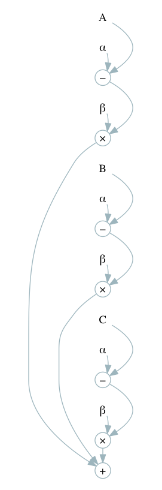
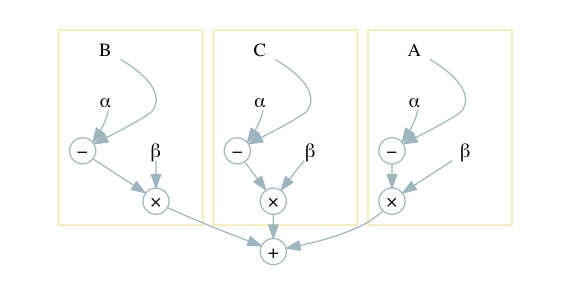
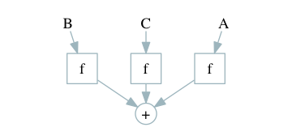
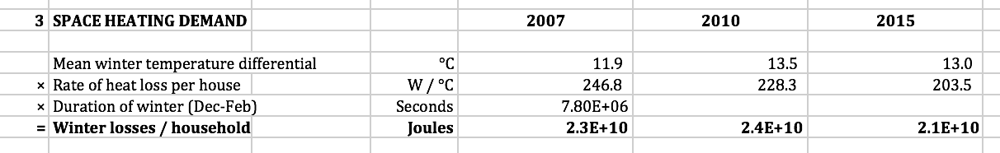

---
title: "Cellular:"
subtitle: "A proposal for better spreadsheets"
author: "James Geddes"
date: "May 2016"
theme: ati
transition: fade
transitionSpeed: fast
controls: !!str false
center: true
...

The West Coast Mainline débâcle
-------------------------------


<div class="notes">

In 2012, the franchise to run the train service on the West Coast intercity
routes, at that time run by Virgin, was sent out to tender. Bidding companies
submitted details of their bid, including detailed financial projections, to the
Department for Transport. A company called FirstGroup won the bid and Virgin
promptly launched a legal challenge.

As a result of the challenge, the award was scrapped. Three civil servants were
suspended. Apparently at least £40m was paid to the bidders in compensation. A
review found "significant technical flaws" in the way the bidding process was
run. 

At the heart of those technical flaws appears to have been a large spreadsheet. 
</div>

It's not just government
------------------------

<div class="notes">
Here's another example.

There were several problems with Reinhart and Rogoff's paper, some of which were
simply debatable assumptions, and these had a greater effect on the result than
the spreadsheet error. However, it was unarguable that there was a spreadsheet
error. It was an illuminating one, and we'll take a look at it later.
</div>

<hr/>
Carmen M. Reinhart, Kenneth S. Rogoff (2010). "Growth in a Time of
    Debt". *American Economic Review* **100** (2): 573–78.

<hr/>

> “George Osborne’s favourite ‘godfathers of austerity’ economists admit to
> making error in research” — the *Mirror*

> “The Rogoff-Reinhart data scandal reminds us economists aren’t gods” — *The Guardian*

> “The Excel Depression” — Paul Krugman

And some limitations are fundamental
------------------------------------

{width=80%}

<div class="notes">
1. Where is the uncertainty?

2. What should we do in year 2? 
</div>

-------------------------------------------------------------------------------


<div class="notes"> 

Hello. My name is James Geddes and I have some bad news for you: the world runs on
Excel.

From 2002 to 2009 I was a strategy consultant. I helped some of the largest
companies in the world make decisions. I helped an airline open a new
transatlantic route; I helped a mining company improve the performance of their
mines; I even had the privilege of helping a chain of pubs set the price of
beer.

How did I know what to advise our clients? I built models. A model is a
mathematical simplification of the world. It keeps you honest. It lets you test
out your ideas. If I make such-and-such a change, what will happen to my
profits?

I worked for one of the most prestigious stategy consulting firms. We pride
ourselves on our quantitative focus. We must use some pretty amazing modelling
tools, right? Well, we used Excel. Excel *is* pretty amazing in some ways --
it's amazing because *everyone can use it*. It's less amazing in other ways.

From 2009 to 2014 I worked at the Department of Energy and Climate Change. I
worked with a team attempting to answer the question, how do we reduce the UK's
greenhouse gas emissions by 80% over the next 40 years? To answer this question,
we built a model: I was the architect of this model although you could say that
the godfather of the model was David MacKay. The model simulated the entire
energy system of the UK for 40 years. We must have used some pretty complex
software, right? Well, we used Excel. It *was* a pretty sophisticated Excel
model in some ways. Less so in others.

Directly as a result of the West Coast mainline debacle, the government produced
a review -- the MacPherson review -- to explain how to build and quality assure
models properly. That review cited the 2050 model as one of its examples of how
to do it right.

Government runs on Excel. That's what government analysts use. Often, of course,
analysis is outsourced to a technical consulting company. *They* might use
linear programming or something. But in government: Excel. 

Later on, we helped other governments build their own versions of the
model. China build one, India built one, even Wallonia built one. Each time we
helped a country build their model we would reconstruct our enormous Excel
spreadsheet, painfully making hundreds of manual changes, introducing errors as
we did so.

Well, I've had enough. I never want to build another Excel model again. Cellular
is my plan.

Visicalc (1979) was the “killer app” for the Apple II. You bought an Apple II because you wanted to run Visicalc. Lotus 1-2-3 was the killer app for PCs. 
Microsoft Multiplan -- 1982
Lotus 1-2-3 -- 1983
Excel Mac -- 1985
Excel Windows -- 1987
Quattro Pro -- 1988 (Intended to compete with Lotus, still available from Corel(!))
Improv -- 1991 (Innovative -- separated data, view, and formulas)
Analytica -- 1996
Google -- 2006

</div>

-------------------------------------------------------------------------------

<!-- ========================= TABLE OF CONTENTS ========================== -->

### Background to spreadsheet modelling

### The challenge of doing better

### Cellular

### The challenge of doing cellular

<!-- =================== A BRIEF HISTORY OF SPREADSHEETS ================== -->

Background to spreadsheet modelling
-----------------------------------

-----------------


VisiCalc: the first ‘killer app’
--------------------------------


<div class="notes"> 

A quick word here about what I'm not going to discuss. VisiCalc did not have any
sort of embedded programming environment. Excel does, however: it has Visual
Basic for Applications, VBA. VBA is a complete programming language. Any of the
restrictions I'm going to discuss could I suppose be worked around by
sufficiently clever use of VBA. Indeed, I've built models with VBA --
particularly in order to automate some part of a workflow so that end-users did
not have perform a series of manual steps. 

I'm not going to make a strong argument here. Let me just say that I have never
seen a model which includes VBA which is at all comprehensible. In terms of
clarity and robustness, VBA has in my experience only ever made things worse.

</div>

Excel has been dominant for 20 years
------------------------------------


<div class="notes">
Excel has, perhaps, on the order of 750 million users.
</div>


<!-- =================== THE CHALLENGE OF DOING BETTER  ================== -->

The challenge of doing better
-----------------------------

-----------------

{width=60%}

<div class="notes">
* NB: Spreadsheet error was not the only issue taken with the paper. But it's a
  good example of the sort of errors that occur. 

* First, some structures that we see often in a spreadsheet:
   - A set of values down the left; a set of values across the top; and in the
     intersections values whose meaning is codified by the product of the row
     and column headers.
	 
	 There are many ways to lay out a spreadsheet; this is one of them. It has
     the virtue of being structured and of conforming to the two dimensions
     available.
	 
   - A expression whose arguments are a set of related data.

* There are also some problems common to spreadsheets:
   - Metadata (formatting) used to convey meaning -- where is the key? Is it
     important? 
   
   - Inputs, intermediate values, and outputs mixed up. A well-designed
     spreadsheet has a linear ordering of data flow: eg, top to bottom. Here is
     not clear what the "maximum" etc fields at the top are.

   - Hidden columns. What's going on in there?
   
   - And of course the major problem with this spreadsheet, which is a simple
     formula error. 

* How can we fix this kind of error? 

</div>


How do we make good software anyway?
------------------------------------

> The art of programming is the art of organising complexity [...]
> — *Edsger W. Dijkstra* (1930–2002)

> Controlling complexity is the essence of computer programming.
> — *Brian Kernighan* (1942–)

> There are two ways of constructing a software design: One way is to make it so
> simple that there are obviously no deficiencies, and the other way is to make
> it so complicated that there are no obvious deficiencies. 
> — *C. A. R. Hoare* (1934–)

<div class="notes">
Okay, so how do we control complexity?
</div>


Modularity and abstraction
--------------------------

<table>
<thead>
<tr>
<th width="20%" style="text-align: center;">Complex</th>
<th width="40%" style="text-align: center;">Modular</th>
<th width="40%" style="text-align: center;">Abstract</th>
</tr>
</thead>
<tr>
<td style="text-align: center; vertical-align: top;">

</td>
<td style="text-align: center; vertical-align: top; font-size: 70%;">


Decompose the system into separate, weakly-coupled parts, with
well-defined interfaces between them.
</td>
<td style="text-align: center; vertical-align: top; font-size: 70%;">


“Abstraction principle: Each significant piece of functionality in a program
should be implemented in just one place in the source code. Where similar
functions are carried out by distinct pieces of code, it is generally beneficial
to combine them into one by *abstracting out* the varying parts.” 

— Benjamin C. Pierce, *Types and Programming Languages* 
</td> </tr> </table>

<div class="notes">

Let me outline for you some of the challenges faced by spreadsheet
modellers. I'm going to spend some time on this slide and the next one.

Consider in particular three good practices in software development. There are
many practices, of course, such as: unit testing, requirements specification,
coding conventions, and what have you; but these two seem to ne to get to the
essence of *programming* as opposed to an arbitrary technical design activity.

First of all, if you have a complicated problem, you should break it down into
subproblems, each of which is simpler. Ideally, each subpart would do one,
conceptually coherent, thing. Also, the connections between the subparts should
be as simple as possible -- they should be "weakly coupled." All this means that
one can worry about one subpart at a time.

Second, there's a principle that's often expressed as "Don't repeat yourself."
Any time you find yourself doing thing same thing over and over: don't. Write it
once, in one place, and re-use the code you've written where you need it. Again,
this means fewer places to look and therefore fewer things to worry about at
once. 

This second step often requires some kind of abstraction or generalisation. It's
not always obvious that one is doing the same thing. Often, in fact, one is
doing "the same thing, *mutatis mutandis*, and then the goal is to write a more
general model that can be reused in specific circumstances. 

</div>


Spreadsheets *kind of* support modularity
---------------------------------------

* Worksheets are often used to separate concerns
{width=65%}

* Columns are often used to group elements of a repeated calculation
{width=65%}

* **But**: it's hard to define the "interfaces"
```
=IFERROR(INDEX(INDIRECT($C10 & ".Outputs[" & this.Year & "]"),
               MATCH(G$5, INDIRECT($C10 & ".Outputs[Vector]"), 0)), 0)
```

<div class="notes">

In some sense, Excel does quite well here. Of course, it's up to the modeller to
correctly choose the subproblems, but once she does so, Excel provides some
presentational techniques to help manage the separation. One can place different
tasks on different worksheets, for example, or, for simple submodels, in
different rows or columns.

Most good modellers will do precisely this. Indeed, organisations typically set
up standards for the use of each worksheet: here's an example of one such.

Still, it's not great. It's not enough simply to separate different parts of the
model: one must define the ways in which the parts interact. Most programming
languages have some facility for constructing the interface between
components. That facility will typically ensure that the components cannot be
used except through the interface, a constraint known as "information hiding" --
not keeping secrets, but making sure that it's clear how and when one part of
the model interacts with another. In Excel one must enforce such separation
through convention and practice. For example, in the 2050 Calculator, we made a
rule that inputs to a worksheet must exist only in a defined block at the top of
the worksheet; when those values were needed somewhere in the worksheet, they
were taken from that block at the top, not directly from source.

And perhaps this principle finds its most useful expression in the design of
"libraries": pre-built software components that perform some task commonly used
in other programs. Almost every Excel model is built *de novo*. There's no
"import workbook". (Well, you can copy and paste but that never leads anywhere
good.) Real models of the real world involve physical units and every
spreadsheet that uses units has an *ad hoc* solution to the problem. It would be
nice to solve this problem once and allow modellers to re-use that solution. It
would be even nicer if, when we discovered bugs in or made improvements to our
common solution, those changes could painlessly be incorporated in users' models.

You know -- just to say -- looking at the third example, isn't it absolutely
clear that if you can do *that* -- surely, *surely* you could write some code!

</div>

Spreadsheets *do not* support abstraction
-----------------------------------------

*  Operations are repeated

    {width=65%}

*  Large formulae are repeated

    ```
    =IFERROR(INDEX(INDIRECT($C10 & ".Outputs[" & this.Year & "]"),
                   MATCH(G$5, INDIRECT($C10 & ".Outputs[Vector]"), 0)), 0)
    ```

* No structured data, higher-order functions, ...

<div class="notes">

One often wishes to abstract some calculation and the re-use it. It is very hard
to do this in Excel. About the best we can do is copy the calculation from one
cell to another and make sure that references to other cells are made relative
to the copied cell. We can assume that this is what was done, for example, in
the Reinhart and Rogoff model.

Why is this a problem? It's a problem because we are repeating ourselves. Once
we repeat ourselves, inevitably one of those repetitions will be wrong. There's
no way to tell Excel, "look, this is the same calculation, so make sure you
really are computing the same calculation."

(Note to experienced modellers: array formulae are a thing that exists, of
course. In some sense, array formulae are one of the most "Excel-like" things in
Excel. But as you know, they have their own problems. And VBA also exists but --
at least in my view -- there is a huge impedance mismatch between the "Excel"
way of doing things and the "VBA" way of doing things.)

Repeating larger blocks is much harder. Typically the problem is that you want
to repeat something *mutatis mutandis* and so the question is, how do you
explain which mutandis must be mutatis? Here's an example from the 2050
Calculator.

Why did I write this monstrosity? So that an entire worksheet could be
reproduced from a copy of another one, whilst making sure that the copy "knew"
it was a copy.

Look aActually, this example is a good illustration of the challenges of the third
principle. What does all this palavar *mean*? In a spreadsheet, every expression
is written at the lowest level -- the only level. To work out what something is
trying to do it's necessary to, well, work it out. We get around this with
conventions -- naming conventions, formatting conventions, structure conventions
-- but it's a very weak solution. 

This formula looks up a particular energy flow from a particular sector for a
particular year, making sure the result is zero if that kind of energy isn't
produced or consumed by that sector. But you wouldn't know it to look at this.

It's worse than you think. Because of a flaw in the way certain references are
implemented in Excel, one has to encode them in character strings! That, right
there, will be -- and was -- an enormous source of bugs when you want to create
a similar model. 

So our task is clear: figure out how to introduce these development practices
into a spreadsheet paradigm. But we must be careful.

</div>

So why do people use spreadsheets?
----------------------------------

1. Incremental
    
	- You can start with very little knowledge
	- Even the basic stuff is useful
	- Even arranging numbers on the page is useful
	- No big jumps

2. Immediate

	- Changes are immediately reflected in the output
	- Faster learning, quicker debugging

3. ... and, perhaps, because abstraction is not easy

<div class="notes">

Here's our main problem. There's a *reason* that we can't apply those three
software development practices in Excel, which is that spreadsheets don't
support them. And the reason for that is that spreadsheets do support something
else: they support people. 

Spreadsheets are incremental. You can start small and build up in easy
steps. And even the small stuff is useful. 

They are immediate. If you like, the edit-compile-test loop is very, very
fast. That makes learning easier and it makes debugging quicker. 

And of course, they are not abstract, and perhaps abstraction is
hard. Certainly, since there are no abstractions there are, *a fortiori*, no
leaky abstractions.

So if we are going to make something that people will use, we had better keep
those features of spreadsheets that made them usable in the first place.  

You know, there are two kinds of complexity in the world. 

FIXME: Story of Ptolemaic epicycles (AD 100 ish) vs. Newton's laws (late 1600s) resulting in Keplerian
motion (early 1610-1620s) 

</div>


The plan
--------

1. Observe that spreadsheets are already a lot like a simplistic programming
   language
   
2. Write this language explicitly, so that spreadsheets are written as programs

    - whilst keeping the benefit/cost tradeoff positive!
   
3. Generalise the language to include more powerful features

    - without losing the ease of use!


<!-- ===================== THE PLAN ==================== -->

Cellular
--------

### 1. Spreadsheets are programs


Every spreadsheet is a graph
----------------------------

```
   |       A         |      B     |
===+=================+============+
 1 | Salary          |      21000 |
 2 | Allowance       |      11000 |
 3 | Taxable income  |  = B1 - B2 |
 4 | Basic rate      |        0.2 |
 5 | Tax payable     |  = B3 * B4 |
```


<div class="notes">

Here is a simple model written as a spreadsheet. It's a typical spreadsheet
model. Computation proceeds from inputs to outputs; in this case from
top-to-bottom. It's considered good design practice to lay out a spreadsheet in
this way to aid in comprehension. In some sense, it's a primitive form of
information hiding: if you want to find the values that enter into a particular
computation you know that must look above the cell containing the computation.

The cells of any spreadsheet can be arranged as the nodes in a directed graph. A
node in this graph is either a value or an expression of the values in other
nodes and the arrows of the graph show which cells depend on which others. I am
going to leave out the comments for these examples but clearly part of the
challenge will be to figure out how to incorporate them since they play a key
role in real spreadsheets.

The graph is acyclic: Excel will complain if the spreadsheet contains what it
calls "circular references". It is possible to force Excel to allow cycles, but
models incorporating such features are thought of as something of a hack.

Some cells in this example have no dependencies nor are dependent on other
cells: these are the labels, which I think are akin to comments in a program.

Well, now we have an expression graph. In fact, we have what looks very like an
abstract syntax tree, such as built by a compiler. In which case, we ought to be
able to write down one or more languages which "compile to" precisely this
expression graph.

This language be extremely simple: it is a purely functional language with
neither iteration nor recursion; nor are functions first-class values.

</div>


From spreadsheet to program
---------------------------

Topological sort:


Then write out each step:
```pascal
B1 := 21000
B2 := 11000
B3 := B1 - B2
B4 := 0.20
B5 := B3 * B4
```

In my view, the burden of naming is too high. But this language ("grid"?) could be used as
a "universal spreadsheet language".

<div class="notes">

Here's one approach, which is almost a direct translation of the spreadsheet. We
take the expression graph of the spreadsheet and linearise it. Note that 

Then we simply bind the value of each node to a different symbol. Here I've
chosen the symbols to be precisely the names of the cells that gave rise to this
graph.

Execution proceeds in a single path: there are no branches or
loops. (Conditionals are expressions.)

In this view, a program consists of a series of assignments, the left-hand side
of which is a previously unused symbol and the right-hand side is an expression
involving primitive operators and functions and previously-named symbols.

Any directed acyclic graph can be written in this way -- it doesn't have to be a
tree as in this example.

So this could be our programming language. It has the nice feature that, as a
"step by step" recipe, it appears to follow the spreadsheet modeller's thought process.

Of course, we'd still need some sensible way of assigning these variables to
cells: a single column spreadsheet is not particularly user friendly.

A larger problem, in my view, is that this style imposes a cognitive burden on the modeller
in that it requires the modeller to worry about things they don't want to worry
about: specifically, naming things. Choosing names is hard, and the beauty of
spreadsheets is that you don't have to choose names: you just use an empty
cell. You don't even have to remember the name later, you can just point at the
cell.

That barrier seems to me to be too high. My intuition is that spreadsheet
modellers will find it too hard to create names. And why should they? This
language is too low-level.

However, I think it is a good *final* target. It's like "machine code for
spreadsheets", in that, with the exception of layout, we could convert this into
any particular spreadsheet: Excel, LibreOffice, Numbers, Google docs, and so
on. 

I propose the name "grid" for this language (which is still somewhat undefined).

</div>


From program to spreadsheet (I)
-------------------------------

Conventional function syntax (built-in functions only):
```C
times(0.20, minus(21000, 11000))
```

Then:

1. Generate expression graph
2. Find its topological sort
3. Generate "single static assignment"
4. Lay out the result (in some clever way)

Hypothesis: inversion of "data flow programming" mindset familiar to spreadsheet
modellers is a barrier. (cf. magrittr in R.)

<div class="notes">

What about conventional syntax? 

Well, it has the benefit over the previous attempt that we don't have to make up
names for things. And it looks like a conventional (functional) programming
language.

But in fact I think this is a problem. Whatever cellular is, it probably had
better *not* look like a conventional programming language. Spreadsheet
programmers don't get programming languages, otherwise they'd be programmers. 

My hypothesis here is that -- if we go back to the original tax calculation --
spreadsheet programmers think in a dataflow model. They start with the data
(because it's concrete!) then that data is transformed in some way, then it's
transformed in some other way, until we get to the answer. 

In contrast, the standard nested functional application is precisely the other
way round: it says do X to the result of doing Y to the result of doing Z to
A. Of course, we could unwrap the functions by naming the arguments -- but then
we're back to the naming problem.

</div>


From program to spreadsheet (II)
--------------------------------

Why not just write the spreadsheet as if you were writing a spreadsheet?
```scheme
21000             ; Salary
11000             ; Personal allowance
-                 ; = Taxable income
0.20              ; Basic rate
*                 ; = Tax payable 
```

* No names; intuitive ordering

* Direct translation to spreadsheet graph

* But postfix languages haven't caught on. Why not?

Still missing lambda abstractions, iteration, etc. But just as powerful as
spreadsheet. Perhaps a good intermediate representation? (Provisional name
"nocell".)

<div class="notes">


</div>


How do we add "real" language features?
---------------------------------------

1. "Compile" a language to "nocell".
   
    - Unwrap loops, expand functions, ...
   
2. Or make "cell" a "nocell"-generating language

    - "Spreadsheets as values"
   
    - More interactive


Uncertainty
-----------

* Don't reinvent the wheel

* Use existing language 


Broad architecture
------------------

Without uncertainty:


With uncertainty:


Further thoughts
----------------

1. Layout is half the battle but if solved would encourage adoption.

	- "LaTeX for spreadsheets"
	
2. "Compilation" vs "Generation".

3. How to represent uncertain parameters in "ordinary" Excel?

	- Or compile a "probabilistic 'cell'"?
	

<!-- ==================== THE CHALLENGES OF CELLULAR ====================== --> 
-------------------------------------------------------------------------------

The challenges of cellular
--------------------------


What I think is necessary for success
-------------------------------------

* Must extend the "natural" language of spreadsheets 

* Must allow incremental transition from easy to abstract

* Must be interactive

	- eg, a "REPL" that generates a spreadsheet each time

* Must make some tasks *easier*. eg, 

	- Formatting tables (always a pain);
	
	- Make probabilistic calculations possible.


Other proposals
---------------

* Gencel (templates for Excel)

* User-centred functions (SPJ)

* ModelSheet Authoring (specific kinds of models)

* Tabular

* Improv

* Scenarios (FW)

<div class="notes">
One good question to ask is: what haven't these succeeded?

* Maybe they will, just not yet?

* They involve changing the spreadsheet model

* They involve extensions to Excel (breaks collaboration)
</div>


<!-- ============================= CHALLENGES ============================= -->


UNUSED SLIDES
-------------


Other kinds of models
---------------------

* Maximisation

* Dynamic simulation

* Agent-based simulation

* Equilibrium-finding

* “Full” Bayesian inference


