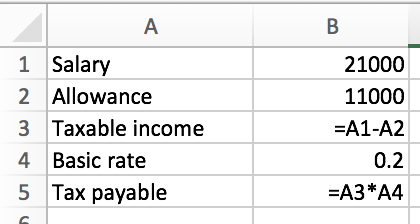
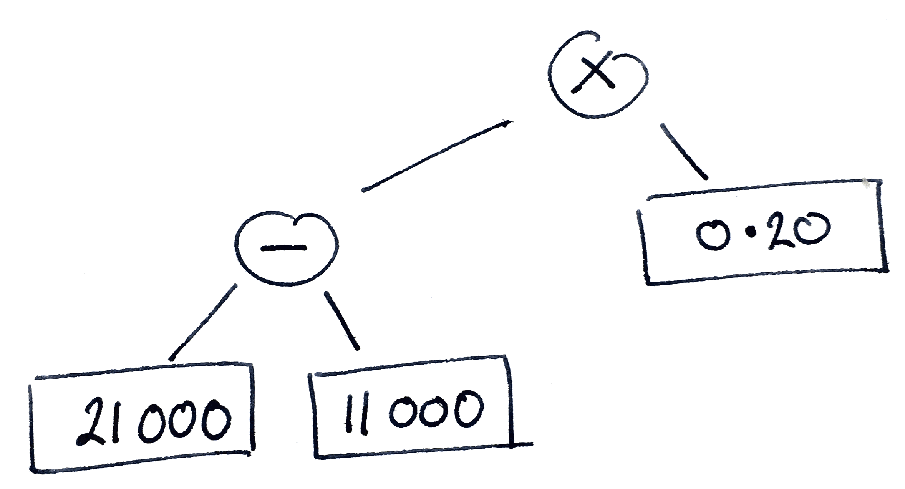

---
title: "Cellular:"
subtitle: "A proposal for less awful spreadsheets"
author: "James Geddes"
date: "May 2016"
theme: ati
transition: fade
transitionSpeed: fast
controls: !!str false
center: true
...

The West Coast Mainline débâcle
-------------------------------


<div class="notes">

In 2012, the franchise to run the train service on the West Coast intercity
routes, at that time run by Virgin, was sent out to tender. Bidding companies
submitted details of their bid, including detailed financial projections, to the
Department for Transport. A company called FirstGroup won the bid and Virgin
promptly launched a legal challenge.

As a result of the challenge, the award was scrapped. Three civil servants were
suspended. Apparently at least £40m was paid to the bidders in compensation. A
review found "significant technical flaws" in the way the bidding process was
run. 

At the heart of those technical flaws appears to have been a large spreadsheet. 
</div>

It's not just government
------------------------

<div class="notes">
Here's another example.

There were several problems with Reinhart and Rogoff's paper, some of which were
simply debatable assumptions, and these had a greater effect on the result than
the spreadsheet error. However, it was unarguable that there was a spreadsheet
error. It was an illuminating one, and we'll take a look at it later.
</div>

<hr/>
Carmen M. Reinhart, Kenneth S. Rogoff (2010). "Growth in a Time of
    Debt". *American Economic Review* **100** (2): 573–78.

<hr/>

> “George Osborne’s favourite ‘godfathers of austerity’ economists admit to
> making error in research” — the *Mirror*

> “The Rogoff-Reinhart data scandal reminds us economists aren’t gods” — *The Guardian*

> “The Excel Depression” — Paul Krugman

And some limitations are fundamental
------------------------------------

{width=80%}

<div class="notes">
1. Where is the uncertainty?

2. What should we do in year 2? 
</div>

-------------------------------------------------------------------------------


<div class="notes"> 

Hello. My name is James Geddes and I have some bad news for you: the world runs on
Excel.

From 2002 to 2009 I was a strategy consultant. I helped some of the largest
companies in the world make decisions. I helped an airline open a new
transatlantic route; I helped a mining company improve the performance of their
mines; I even had the privilege of helping a chain of pubs set the price of
beer.

How did I know what to advise our clients? I built models. A model is a
mathematical simplification of the world. It keeps you honest. It lets you test
out your ideas. If I make such-and-such a change, what will happen to my
profits?

I worked for one of the most prestigious stategy consulting firms. We pride
ourselves on our quantitative focus. We must use some pretty amazing modelling
tools, right? Well, we used Excel. Excel *is* pretty amazing in some ways --
it's amazing because *everyone can use it*. It's less amazing in other ways.

From 2009 to 2014 I worked at the Department of Energy and Climate Change. I
worked with a team attempting to answer the question, how do we reduce the UK's
greenhouse gas emissions by 80% over the next 40 years? To answer this question,
we built a model: I was the architect of this model although you could say that
the godfather of the model was David MacKay. The model simulated the entire
energy system of the UK for 40 years. We must have used some pretty complex
software, right? Well, we used Excel. It *was* a pretty sophisticated Excel
model in some ways. Less so in others.

Directly as a result of the West Coast mainline debacle, the government produced
a review -- the MacPherson review -- to explain how to build and quality assure
models properly. That review cited the 2050 model as one of its examples of how
to do it right.

Government runs on Excel. That's what government analysts use. Often, of course,
analysis is outsourced to a technical consulting company. *They* might use
linear programming or something. But in government: Excel. 

Later on, we helped other governments build their own versions of the
model. China build one, India built one, even Wallonia built one. Each time we
helped a country build their model we would reconstruct our enormous Excel
spreadsheet, painfully making hundreds of manual changes, introducing errors as
we did so.

Well, I've had enough. I never want to build another Excel model again. Cellular
is my plan.

Visicalc (1979) was the “killer app” for the Apple II. You bought an Apple II because you wanted to run Visicalc. Lotus 1-2-3 was the killer app for PCs. 
Microsoft Multiplan -- 1982
Lotus 1-2-3 -- 1983
Excel Mac -- 1985
Excel Windows -- 1987
Quattro Pro -- 1988 (Intended to compete with Lotus, still available from Corel(!))
Improv -- 1991 (Innovative -- separated data, view, and formulas)
Analytica -- 1996
Google -- 2006

</div>

-------------------------------------------------------------------------------

<!-- ========================= TABLE OF CONTENTS ========================== -->

* [A brief history of spreadsheets](#a-brief-history-of-spreadsheets)

* [Modelling with spreadsheets](#modelling-with-spreadsheets)

* Cellular

* Challenges

<!-- =================== A BRIEF HISTORY OF SPREADSHEETS ================== -->

A brief history of spreadsheets
-------------------------------


VisiCalc: the first ‘killer app’
--------------------------------


<div class="notes"> 

A quick word here about what I'm not going to discuss. VisiCalc did not have any
sort of embedded programming environment. Excel does, however: it has Visual
Basic for Applications, VBA. VBA is a complete programming language. Any of the
restrictions I'm going to discuss could I suppose be worked around by
sufficiently clever use of VBA. Indeed, I've built models with VBA --
particularly in order to automate some part of a workflow so that end-users did
not have perform a series of manual steps. 

I'm not going to make a strong argument here. Let me just say that I have never
seen a model which includes VBA which is at all comprehensible. In terms of
clarity and robustness, VBA has in my experience only ever made things worse.

</div>

Excel has been dominant for 20 years
------------------------------------


<div class="notes">
Excel has, perhaps, on the order of 750 million users.
</div>


Modelling with spreadsheets
---------------------------

<!-- ===================== MODELLING WITH SPREADSHEETS ==================== -->

-----------------

{width=60%}

<div class="notes">
* NB: Spreadsheet error was not the only issue taken with the paper. But it's a
  good example of the sort of errors that occur. 

* First, some structures that we see often in a spreadsheet:
   - A set of values down the left; a set of values across the top; and in the
     intersections values whose meaning is codified by the product of the row
     and column headers.
	 
	 There are many ways to lay out a spreadsheet; this is one of them. It has
     the virtue of being structured and of conforming to the two dimensions
     available.
	 
   - A expression whose arguments are a set of related data.

* There are also some problems common to spreadsheets:
   - Metadata (formatting) used to convey meaning -- where is the key? Is it
     important? 
   
   - Inputs, intermediate values, and outputs mixed up. A well-designed
     spreadsheet has a linear ordering of data flow: eg, top to bottom. Here is
     not clear what the "maximum" etc fields at the top are.

   - Hidden columns. What's going on in there?
   
   - And of course the major problem with this spreadsheet, which is a simple
     formula error. 

* How can we fix this kind of error? 

</div>


Software development practices
------------------------------

* Separation of concerns (aka, divide and conquer)
{width=65%}

* Don't repeat yourself (aka, generalise)
{width=65%}

* Say what you mean (aka, abstract)
```
=IFERROR(INDEX(INDIRECT($C10 & ".Outputs[" & this.Year & "]"),
               MATCH(G$5, INDIRECT($C10 & ".Outputs[Vector]"), 0)), 0)
```

<div class="notes">

Let me outline for you some of the challenges faced by spreadsheet
modellers. I'm going to spend some time on this slide and the next one.

Consider in particular three good practices in software development. There are
many practices, of course, such as: unit testing, requirements specification,
coding conventions, and what have you; but these three seem to ne to get to the
essence of *programming* as opposed to an arbitrary technical design activity.

First of all, if you have a complicated problem, you should break it down into
subproblems, each of which is simpler.

In some sense, Excel does quite well here. Of course, it's up to the modeller to
correctly choose the subproblems, but once she does so, Excel provides some
presentational techniques to help manage the separation. One can place different
tasks on different worksheets, for example, or, for simple submodels, in
different rows or columns.

Most good modellers will do precisely this. Indeed, organisations typically set
up standards for the use of each worksheet: here's an example of one such.

Still, it's not great. It's not enough simply to separate different parts of the
model: one must define the ways in which the parts interact. Most programming
languages have some facility for constructing the interface between
components. That facility will typically ensure that the components cannot be
used except through the interface, a constraint known as "information hiding" --
not keeping secrets, but making sure that it's clear how and when one part of
the model interacts with another. In Excel one must enforce such separation
through convention and practice. For example, in the 2050 Calculator, we made a
rule that inputs to a worksheet must exist only in a defined block at the top of
the worksheet; when those values were needed somewhere in the worksheet, they
were taken from that block at the top, not directly from source.

And perhaps this principle finds its most useful expression in the design of
"libraries": pre-built software components that perform some task commonly used
in other programs. Almost every Excel model is built *de novo*. There's no
"import workbook". (Well, you can copy and paste but that never leads anywhere
good.) Real models of the real world involve physical units and every
spreadsheet that uses units has an *ad hoc* solution to the problem. It would be
nice to solve this problem once and allow modellers to re-use that solution. It
would be even nicer if, when we discovered bugs in or made improvements to our
common solution, those changes could painlessly be incorporated in users' models.

And there's a further problem, which is related to the second practice. Only a
certain kind of concern can be separated in Excel. Specifically, it must be a
defined step in the data flow process.

What other concerns might there be? Well, one might wish to abstract some
calculation and the re-use it. Here we have a problem. It is very hard to do
this in Excel. About the best we can do is copy the calculation from one cell to
another and make sure that references to other cells are made relative to the
copied cell. We can assume that this is what was done, for example, in the
Reinhart and Rogoff model.

Why is this a problem? It's a problem because we are repeating ourselves. Once
we repeat ourselves, inevitably one of those repetitions will be wrong. There's
no way to tell Excel, "look, this is the same calculation, so make sure you
really are computing the same calculation."

(Note to experienced modellers: array formulae are a thing that exists, of
course. In some sense, array formulae are one of the most "Excel-like" things in
Excel. But as you know, they have their own problems.)

Repeating larger blocks is much harder. Typically tyhe problem is that you want
to repeat something *mutatis mutandis* and so the question is, how do you
explain which mutandis must be mutatis? Here's an example from the 2050
Calculator.

You know -- just to say -- looking at that, isn't it absolutely clear that if
you can do *that* -- surely, *surely* you could write some code!

Why did I write this monstrosity? So that an entire worksheet could be
reproduced from a copy of another one, whilst making sure that the copy "knew"
it was a copy.

Actually, this example is a good illustration of the challenges of the third
principle. What does all this palavar *mean*? In a spreadsheet, every expression
is written at the lowest level -- the only level. To work out what something is
trying to do it's necessary to, well, work it out. We get around this with
conventions -- naming conventions, formatting conventions, structure conventions
-- but it's a very weak solution. 

This formula looks up a particular energy flow from a particular sector for a
particular year, making sure the result is zero if that kind of energy isn't
produced or consumed by that sector. But you wouldn't know it to look at this.

It's worse than you think. Because of a flaw in the way certain references are
implemented in Excel, one has to encode them in character strings! That, right
there, will be -- and was -- an enormous source of bugs when you want to create
a similar model. 

So our tasks is clear: figure out how to introduce these development practices
into a spreadsheet paradigm. But we must be careful.

</div>


The spreadsheet tradeoff
------------------------

Spreadsheets are ... instead of being ...
-------------------- --------------------------
Concrete             Abstract
Specific             General
Primitive            Composable

<div class="notes">

Here's our main problem. There's a *reason* that we can't apply those three
software development practices in Excel, which is that spreadsheets don't
support them. And the reason for that is that spreadsheets do support something
else: they support people. Spreadsheets are concrete -- what you see is what
there is. They are specific -- what they do is what they do. And their
principles are very simple and they compose in only the simplest way.

There's a reason for these design issues: they make spreadsheets usable by
people. If we're going to fix the problems they bring, we're going to have to
tread carefully.

You know, there are two kinds of complexity in the world. 

FIXME: Story of Ptolemaic epicycles (AD 100 ish) vs. Newton's laws (late 1600s) resulting in Keplerian
motion (early 1610-1620s) 

</div>


Spreadsheets are (a bit) like programs
--------------------------------------

{width=30.5%} {width=30%}

```C
times(0.20, minus(21000, 11000))
```

```pascal
A1 := 21000
A2 := 11000
A3 := A1 - A2
A4 := 0.20
A5 := A3 * A4
```

(No loops or recursion ...)

<!-- ===================== MODELLING WITH SPREADSHEETS ==================== -->

A different approach
--------------------

* Spreadsheets are a programming language -> Extend this

* Spreadsheets are interactive -> So are modern languages

* It's hard to format tables -> Make this easy!

* Probability is impossible -> Make it possible

* Incremental transition from easy to abstract.


What kind of language are spreadsheets?
---------------------------------------


Other proposals
---------------

* Gencell

* User-centred functions

* ModelSheet Authoring

* Tabular

* Improv

* Felienne

* Scenarios

<div class="notes">
One good question to ask is: what haven't these succeeded?

* Maybe they will, just not yet?

* They involve changing the spreadsheet model

* They involve extensions to Excel (breaks collaboration)
</div>


Uncertainty
-----------


Preliminary ideas
-----------------

O --> O --> O


<!-- ============================= CHALLENGES ============================= -->


Other kinds of models
---------------------

* Maximisation

* Dynamic simulation

* Agent-based simulation

* Equilibrium-finding

* “Full” Bayesian inference


	


Next steps
----------

* Timing ...
