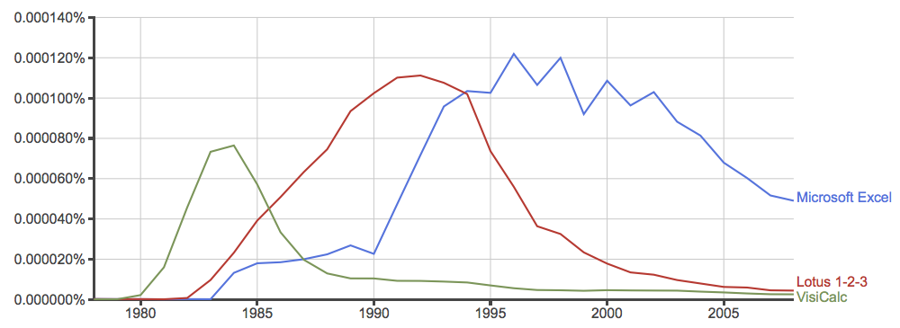

---
title: "Cellular:"
subtitle: "A proposal for less awful spreadsheets"
author: "James Geddes"
date: "May 2016"
theme: ati
transition: fade
transitionSpeed: fast
controls: !!str false
center: true
...

 

Hello. My name is James Geddes and I have some bad news for you: the world runs on
Excel.

From 2002 to 2009 I was a strategy consultant. I helped some of the largest
companies in the world make decisions. I helped an airline open a new
transatlantic route; I helped a mining company improve the performance of their
mines; I even had the privilege of helping a chain of pubs set the price of
beer.

How did I know what to advise our clients? I built models. A model is a
mathematical simplification of the world. It keeps you honest. It lets you test
out your ideas. If I make such-and-such a change, what will happen to my
profits?

I worked for one of the most prestigious stategy consulting firms out there. We
pride ourselves on our quantitative focus. We must use some pretty amazing
modelling tools, right? Well, we used Excel. Excel *is* pretty amazing in some
ways -- it's amazing because *everyone can use it*. It's less amazing in other ways.

From 2009 to 2014 I worked at the Department of Energy and Climate Change. I
worked with a team attempting to answer the question, how do we reduce the UK's
greenhouse gas emissions by 80% over the next 40 years? To answer this question,
we built a model: I was the architect of this model although you could say that
the godfather of the model was David MacKay. The model simulated the entire
energy system of the UK for 40 years. We must have used some pretty complex
software, right? Well, we used Excel. It *was* a pretty sophisticated Excel
model in some ways. Less so in others.

Government runs on Excel. That's what government analysts use. Often, of course,
analysis is outsourced to a technical consulting company. *They* might use
linear programming or something. But in government: Excel. 

Later on, we helped other governments build their own versions of the
model. China build one, India built one, even Wallonia built one. Each time we
helped a country build their model we would reconstruct our enormous Excel
spreadsheet, painfully making hundreds of manual changes, introducing errors as
we did so.

Well, I've had enough. I never want to build another Excel model again. Cellular
is my plan.

> FIXME: Box said, "All models are wrong; the practical question is how wrong
> do they have to be to not be useful?" 

<!-- AGENDA -->

A brief history of spreadsheets

Why the problem matters

How to put it right

Challenges

In the beginning was VisiCalc
-----------------------------

Then came ...
-------------

Visicalc (1979) was the “killer app” for the Apple II. You bought an Apple II because you wanted to run Visicalc. Lotus 1-2-3 was the killer app for PCs. 
Microsoft Multiplan -- 1982
Lotus 1-2-3 -- 1983
Excel Mac -- 1985
Excel Windows -- 1987
Quattro Pro -- 1988 (Intended to compete with Lotus, still available from Corel(!))
Improv -- 1991 (Innovative -- separated data, view, and formulas)
Analytica -- 1996
Google -- 2006

Excel has been dominant for 20 years
------------------------------------

Sometimes research makes the news
---------------------------------

> “George Osborne’s favourite ‘godfathers of austerity’ economists admit to
> making error in research” — the *Mirror*

> “The Rogoff-Reinhart data scandal reminds us economists aren’t gods” — *The Guardian*

> “The Excel Depression” — Paul Krugman

Carmen M. Reinhart, Kenneth S. Rogoff (2010). "Growth in a Time of
    Debt". *American Economic Review* **100** (2): 573–78.

--------------

{width=60%}

* NB: Spreadsheet error was not the only issue taken with the paper. But it's a
  good example of the sort of errors that occur. 

* There are lots of things to note about this spreadsheet!

* How can we fix this kind of error? Separation of code and data ...

West Coast Mainline 2012 
------------------------

[Picture of Virgin trains?]

* Financial model (in Excel) deployed by DfT to assess bids for West Coast
  Rail Line

* "Fundamental mistakes in the communication of assumptions in the
    Department's model"
 
* Led in part to the Macpherson review of quality assurance of government models
  -- in which 2050 Calculator was cited as a good example

* More a transparency issue ... but have you seen a real-life Excel model
  recently? 

David's example of uncertainty
------------------------------

Overview
--------

* Introduction to modelling in government and industry
* Our proposal
* Challenges

More failures
-------------

* Oxford entrance interviews 
      - candidate's registration numbers confused with their marks
  
* MI5 bugs the wrong phones
  - formatting confusion
  
* Mouchel's pension fund overvalued by £4.3,

* Magners cider manufacturer announces revenues up -- by mistake
  - "incorrect calculations"
  
* King's fund revises analysis of cuts in NHS spending in Wales
  - "calculation error"

* AXA Rosenberg spreadsheet error "cover up"

But why?
--------

A brief history of spreadsheets
-------------------------------

* Timeline
* VisiCalc
* Alternatives to Excel

Fixes
-----

* Improv
* Quantrix (?)
* Analytica (?)

Proposal
--------

About me
--------

* Consulting -- Excel
* DECC - Excel
* Data Scientist -- R

About 2050
----------

From the Macpherson review [cite]:

Box 2.A: The 2050 Calculator – Department of Energy and Climate Change The 2050
Calculator is a scenario testing tool that allows users to explore different
ways of reducing UK emissions by 2050. It was developed in-house by the
Department of Energy and Climate Change in 2010. To date over 150,000 unique
users have accessed the tool. 

The 2050 Calculator sets a new standard for **transparency**. Both the model and
its assumptions are published on the internet, and during development DECC
published several “Calls for Evidence” and worked with hundreds of
stakeholders. Users are impressed by the open, honest assessment of uncertainty,
improving trust in the model and its insights. Journalists are enthusiastic; the
Guardian calling it ‘...probably one of the most open and transparent pieces of
policy-making ever undertaken by the British government’.

The transparency of the UK calculator led not only to free quality assurance
from global experts in the field, but also tangible diplomatic benefits. For
example, the Chinese Government published their own version of the 2050
calculator – a major breakthrough in transparency and Sino-UK climate change
co-operation.

The team was also formally recognised, winning the Science, Engineering and
Technology Civil Service Award in 2010.

Challenges
----------

And that's before we get to uncertainty ...
[David's example]

Why do we use Excel, anyway?
- * can start small! (Try making a list on MS SQL Server)
- can do calculations! (Don't need to know abstractions)
- can format results! 
- can link into 
- it's an end-user programming tool

What is modelling?

Can we do better?
- All the ways people are trying to fix this ...

What's wrong?
- copy/paste
- 

What is an Excel model, really?

Ideas for cellular
- DAG
- 
